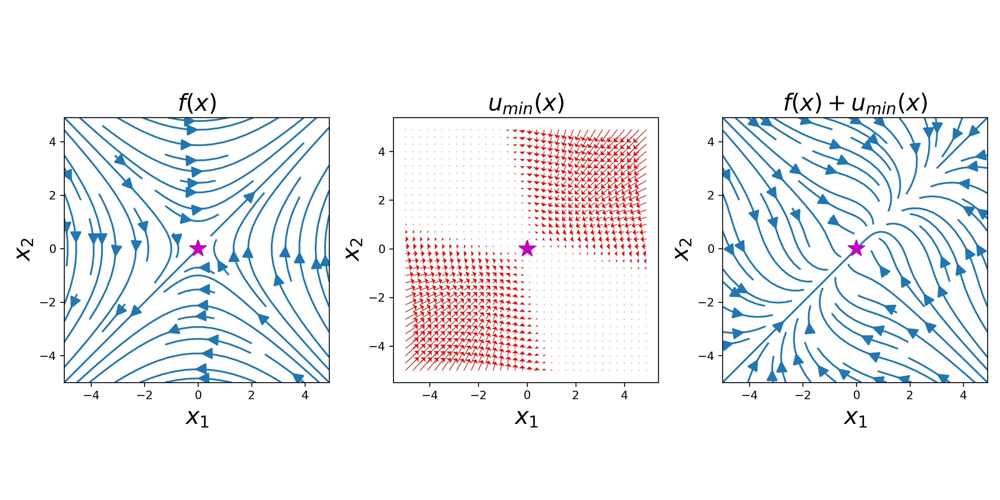
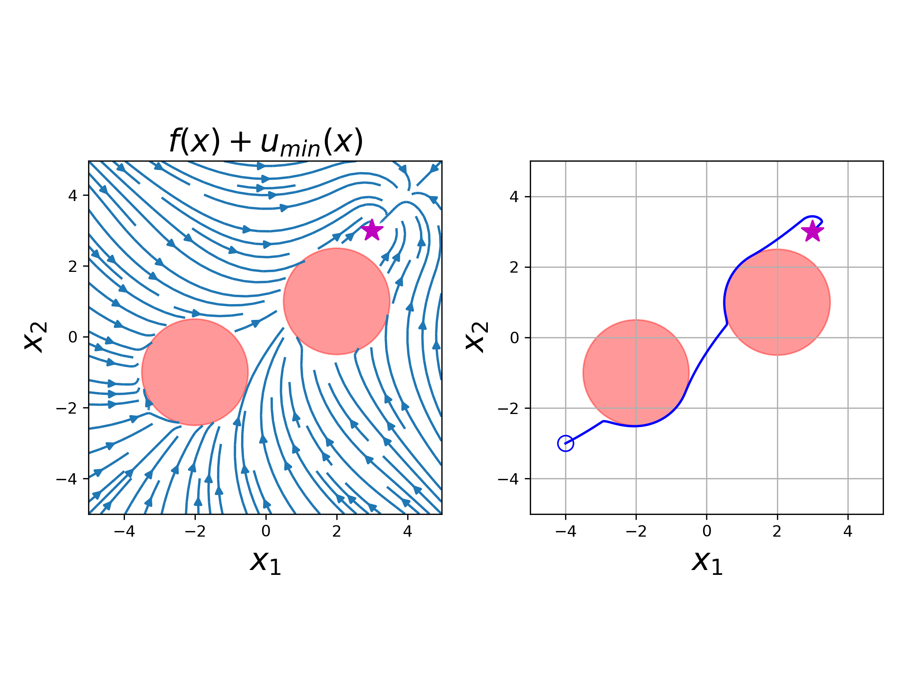

# Implementing a Control Lyapunov Function (CLF)

Define dynamics

$$\dot{x} = \begin{bmatrix} \dot{x}_1 \\ \dot{x}_2 \end{bmatrix} = f(x) + u =  \begin{bmatrix} x_2 \\ x_1 \end{bmatrix} + \begin{bmatrix} u_1 \\ u_2 \end{bmatrix} $$

Define Lyapunov function candidate

$$ V(x) = \frac{1}{2} (x_1^2 + x_2^2) $$

We compute how $V(x)$ changes under the influence of the system dynamics as

$$\dot{V}(x,u) = \frac{\partial V}{\partial x} \frac{\partial x}{\partial t} = \begin{bmatrix} x_1 & x_2 \end{bmatrix} \begin{bmatrix} x_2 + u_1 \\ x_1 + u_2\end{bmatrix} = x_1(x_2 + u_1) + x_2(x_1 + u_2) $$

We want to choose $u$ such that for any given $x \in \mathcal{X} \subset \mathbb{R}^2$,

$$\dot{V}(x,u) + \lambda V(x) = \begin{bmatrix} x_1 & x_2 \end{bmatrix} \begin{bmatrix} u_1 \\ u_2 \end{bmatrix} + 2 x_1x_2 +\lambda V(x)  \leq 0 $$

# Implementing a Control Barrier Function (CBF)

Define dynamics

$$\dot{x} = \begin{bmatrix} \dot{x}_1 \\ \dot{x}_2 \end{bmatrix} = f(x) + u =  \begin{bmatrix} x_2 \\ x_1 \end{bmatrix} + \begin{bmatrix} u_1 \\ u_2 \end{bmatrix} $$

Define the safety condition

$$ h(x) = r^2 - \Vert x \Vert_2^2 $$

where $r$ is the minimum distance you want to be from the origin, making our safe set

$$ \mathcal{C} = `\{x \in \mathbb{R}^2: h(x) \geq 0 \}`. $$

We compute how $h(x)$ changes under the influence of the system dynamics as

$$ \dot{h}(x,u) = \frac{\partial h}{\partial x} \frac{\partial x}{\partial t} = -2\begin{bmatrix} x_1 & x_2 \end{bmatrix} (f(x) + u).$$

We want to choose the minimum $u$ such that for any given $x \in \mathcal{C} \subset \mathbb{R}^2$,

$$\dot{h}(x,u) + \alpha(h(x)) = -2\begin{bmatrix} x_1 & x_2 \end{bmatrix} \begin{bmatrix} u_1 \\ u_2 \end{bmatrix} - 2\begin{bmatrix} x_1 & x_2 \end{bmatrix} f(x) + \alpha(h(x)) \geq 0 $$

where $\alpha(\cdot)$ is a class- $\mathcal{K}$ function.

# Implementing a CLF-CBF

Define safety conditions for avoiding two obstacles  

$$h_1(x) = \Vert o_1 - x \Vert^2_2 - d^2 $$

$$h_2(x) = \Vert o_2 - x \Vert^2_2 - d^2 $$

where $o_1, o_2 \in \mathbb{R}^2$ are the locations of each obstacle and $d > 0$ is the minimum safe distance we wish to maintain away from each obstacle.

$$ \mathcal{C} = `\{x \in \mathbb{R}^2: h_1(x) \geq 0 \wedge h_2(x) \geq 0 \}`. $$

We can formulate the combined CLF and CBF conditions by satisfying the following linear constraints with respect to $u$

$$ \begin{bmatrix} (x - x_e)^\top \\ 2(o_1 - x)^\top \\ 2(o_2 - x)^\top  \end{bmatrix} u  \leq \begin{bmatrix} -\frac{\partial V}{\partial x} f(x) - \lambda V(x) \\ \frac{\partial h_1}{\partial x} f(x) + \alpha h_1(x) \\ \frac{\partial h_2}{\partial x} f(x) + \alpha h_2(x) \end{bmatrix}$$

